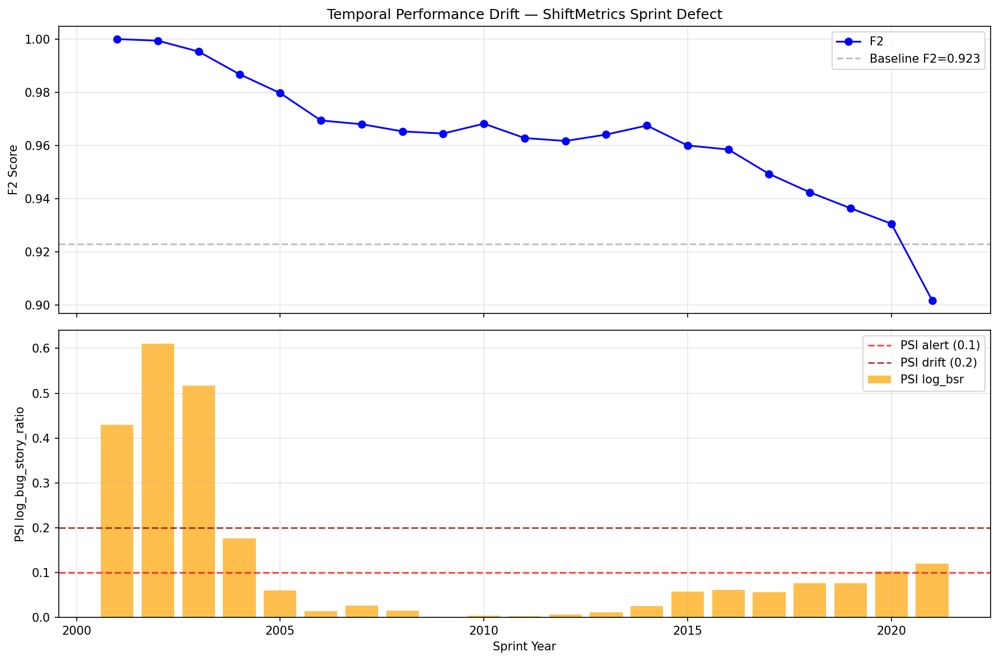
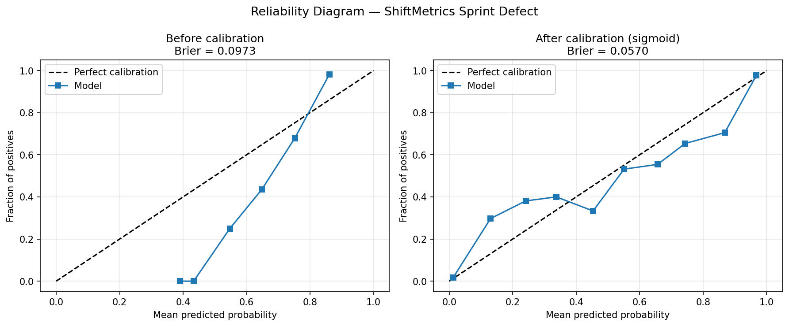
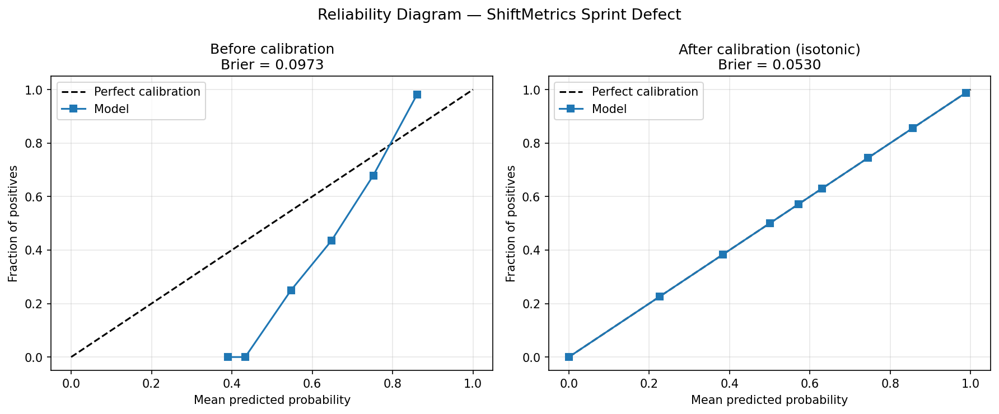
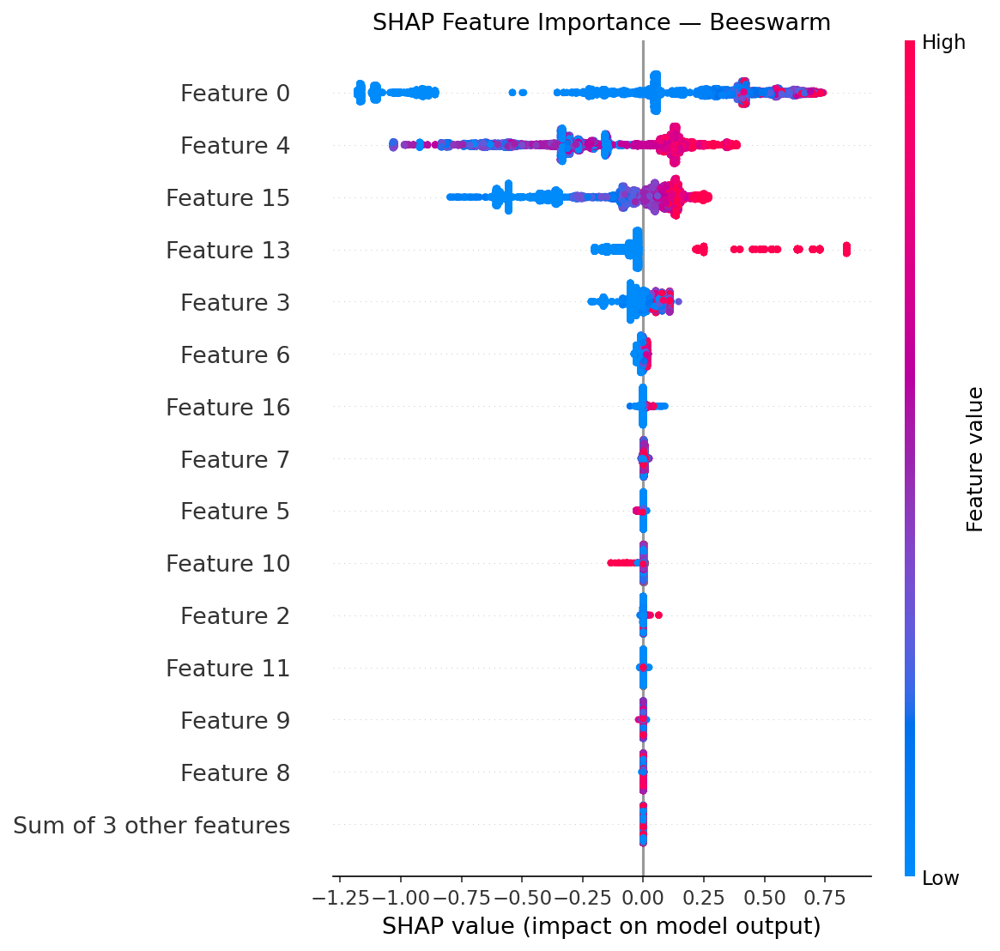
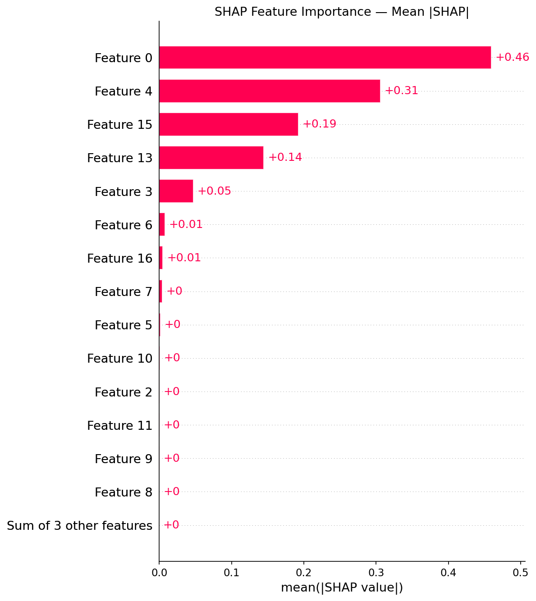
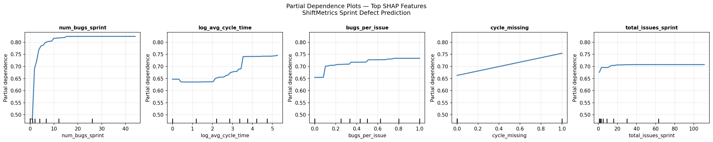
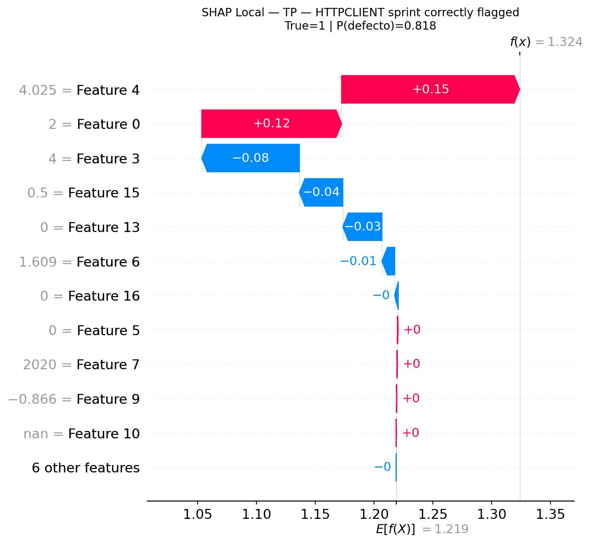
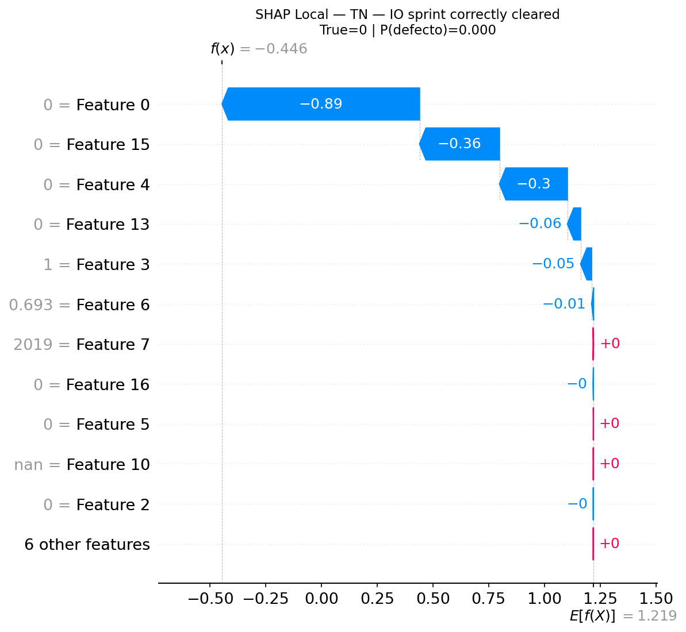
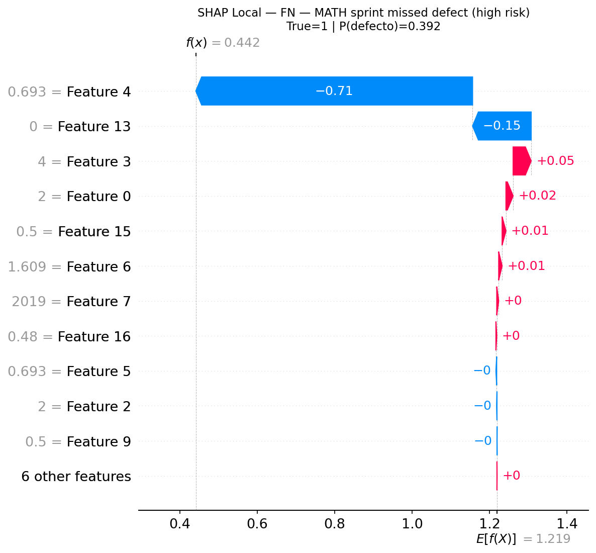
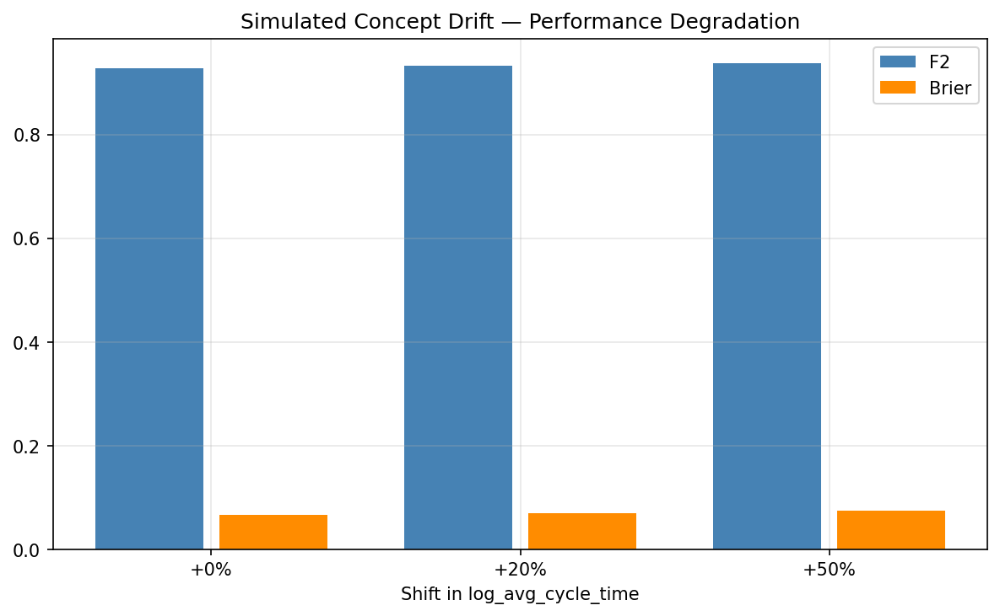

# SI7009 — ShiftMetrics Sprint Defect Prediction
## Informe Tecnico: EDA, Modelado y Evaluacion

**Proyecto**: ShiftMetrics — Prediccion de Defectos Escapados en Sprints de Software
**Cohorte**: EAFIT MDS&A
**Infraestructura**: Vertex AI Workbench / BigQuery / MLflow (Cloud Run) / GCS
**Fecha**: 2026-Q2

---

## 1. Analisis Exploratorio de Datos

### 1.1 Entendimiento de los datos

El problema central de SI7009 consiste en predecir, antes del cierre de un sprint de desarrollo de software, si ese sprint producira al menos un defecto que escape al ambiente de produccion. La variable objetivo, `defecto_escapado`, es binaria: toma el valor 1 si al menos un issue clasificado como bug permanecio sin resolver al momento del cierre o fue reportado en produccion durante o inmediatamente despues del sprint.

La fuente de datos es la tabla `shiftmetrics_gold.sprint_features` en BigQuery, construida mediante un pipeline ETL sobre los datasets Silver del proyecto. La capa Silver integra cuatro fuentes heterogeneas: issues de Apache JIRA (fuente primaria), metricas CK del repositorio PROMISE (codigo fuente estatico), senales DORA de GHArchive (actividad de GitHub), y datos de ciclo de Red Hat. La tabla Gold contiene 42,747 registros de sprint que abarcan 42 proyectos del ecosistema Apache y cubren el periodo 2000-2021.

El alcance temporal es inusualmente amplio para un dataset de calidad de software: veintidos anos de historia permiten estudiar la evolucion del proceso de desarrollo —migracion de modelos waterfall a agile, reduccion de ciclos de entrega, especializacion de roles— como un factor de variabilidad endogena que el modelo debe aprender a navegar, no solo como ruido.

La distribucion de clases presenta un desbalance moderado hacia la clase positiva: 70.45% de los sprints tienen al menos un defecto escapado (30,116 positivos frente a 12,631 negativos). Este nivel de desbalance no es extremo —no requiere tecnicas de resampling agresivas— pero si suficiente para que un clasificador ingenuo que prediga siempre la clase positiva alcance un F2-score de 0.916, estableciendo un umbral de entrada no trivial para cualquier modelo aprendido. La consecuencia practica es que la metrica relevante no es la exactitud (accuracy) sino la precision-recall y, especificamente, el F2-score, que pondera el recall el doble que la precision para reflejar que perder un defecto escapado (falso negativo) es mas costoso que una revision innecesaria (falso positivo).

La cobertura de las distintas fuentes de datos es heterogenea y refleja los limites reales de integracion entre sistemas:

- Features de conteo Jira (`num_bugs_sprint`, `num_stories_sprint`, `num_tasks_sprint`, `total_issues_sprint`): cobertura del 100%, ya que todos los sprints son registros de Jira por definicion.
- `avg_cycle_time_days`: 91.8% de cobertura. El 8.2% restante corresponde a sprints sin issues resueltos o sin datos de fecha de resolucion.
- `bug_story_ratio`: 37.5% de cobertura. El 62.5% de sprints sin este valor corresponde a sprints donde no hay bugs, no hay stories, o los tipos de issue no permiten calcular el ratio. La ausencia misma es informativa.
- Metricas DORA (`deploy_frequency_weekly`, `change_failure_rate`): 9% de cobertura, limitada a los ~20 proyectos de Apache con actividad en GHArchive 2022. El mismatch temporal entre GHArchive (datos 2022) y los sprints (hasta 2021) hace que estas features sean casi siempre nulas.
- Metricas CK (PROMISE): 1.6% de cobertura. El dataset PROMISE cubre proyectos como ant, camel o lucene, que no tienen overlap con los project keys de Apache Jira (que son en mayusculas: HADOOP, SPARK, etc.). La cobertura es esencialmente residual.

La ausencia de overlap entre fuentes secundarias y la fuente primaria no es un error de implementacion —el pipeline ETL es correcto— sino una limitacion estructural del dominio: los datos de metricas de codigo fuente (PROMISE) y de actividad de repositorios (GHArchive) no se alinean temporalmente ni en identificadores de proyecto con los datos de gestiona de incidencias de Jira.

### 1.2 Preparacion de los datos

#### Division temporal

La decision de diseno mas critica en este proyecto es la division temporal del dataset. Dado que los sprints son observaciones ordenadas en el tiempo, una division aleatoria producaria leakage temporal: el modelo entrenaria con datos del futuro y evaluaria sobre datos del pasado, generando estimaciones optimistas e irreproducibles en produccion.

Se implemento un esquema de cuatro vias, cada split con un rol especifico e irrepetible:

- **Train (2000-2014, ~25,400 filas)**: Conjunto de entrenamiento para la optimizacion bayesiana de hiperparametros. Optuna entrena modelos candidatos sobre este split y los evalua en val.
- **Cal (2015, ~1,700 filas)**: Holdout exclusivo para calibracion de probabilidades. El modelo refit —entrenado sobre train+val al final del HPO— nunca ve este split durante el entrenamiento. Esto garantiza que el calibrador ajustado en Cal mide error de calibracion real, sin triple-dipping.
- **Val (2016-2018, 12,941 filas)**: Conjunto de evaluacion del HPO y de seleccion del umbral operativo. Es el unico split que Optuna usa para calcular F2 y seleccionar el mejor trial. Tambien es el split sobre el que se busca el threshold optimo (F2 y ROI).
- **Test (2019-2021, 6,683 filas)**: Conjunto de evaluacion final, intocable. No interviene en ningun paso de entrenamiento, calibracion o seleccion de threshold. Las metricas de test son las unicas que se reportan como estimacion del desempeno en produccion.

La razon para un split de calibracion separado, en lugar de usar val directamente, es evitar que el calibrador sobreajuste a la misma distribucion sobre la que se optimizaron los hiperparametros. Con un holdout limpio en Cal, el Brier score reportado en Cal refleja la calidad real de calibracion del modelo refiteado.

#### Feature engineering

El pipeline de feature engineering opera enteramente en `feature_store.py` y aplica las mismas transformaciones a todos los splits sin ninguna informacion que fluya de test hacia train.

**Transformaciones log1p**: Las tres features de magnitud con distribuciones fuertemente asimertricas reciben la transformacion log(1+x) antes del entrenamiento:

- `avg_cycle_time_days`: p50=90 dias, p99=2,341 dias. La distribucion es log-normal — confirmado empiricamente por la linealidad del Q-Q plot en escala logaritmica. Sin transformacion, los valores extremos dominan el gradiente del modelo.
- `bug_story_ratio`: p50=2.5, p99=48. Heavy right-skew: unos pocos sprints con decenas de bugs por story introducen una cola que eleva artificialmente la importancia de valores atipicos.
- `total_issues_sprint`: p50=5, p95=98. Transformado para estabilizar la varianza en sprints grandes.

**Indicadores de ausencia**: Tres features binarias codifican si la feature base correspondiente es nula: `bsr_missing` (62.5% ausente), `cycle_missing` (8.2% ausente), `dora_missing` (91% ausente). Estos indicadores son calculados antes de cualquier imputacion, de modo que el modelo puede distinguir entre un valor bajo real y un cero de imputacion. El ranking SHAP ubica `cycle_missing` en el cuarto lugar de importancia global, confirmando que la ausencia de datos de ciclo de vida es una senal de proceso inmaduro que el modelo aprende a explotar.

**Encoding ciclico del mes**: `sprint_month_sin = sin(2pi * month / 12)` y `sprint_month_cos = cos(2pi * month / 12)`. El encoding ciclico preserva la continuidad entre diciembre y enero, que seria quebrada por un encoding ordinal estandar. Esto permite al modelo capturar patrones estacionales de calidad —sprints de fin de ano frecuentemente tienen mayor presion de entrega y menor coverage de testing.

**Features de interaccion**:
- `bugs_per_issue = num_bugs_sprint / max(total_issues_sprint, 1)`: Normaliza el conteo de bugs por la velocidad del sprint. Un sprint con 5 bugs en 5 issues (100% bug density) es cualitativamente distinto de un sprint con 5 bugs en 100 issues (5% bug density). Esta normalizacion permite al modelo discriminar entre la magnitud absoluta y la proporcion de defectos.
- `log_cycle_x_bsr = log_avg_cycle_time * log_bug_story_ratio`: Captura la interaccion entre ciclos largos y alta proporcion de bugs. Un sprint con bugs cronicos que tardan mucho en resolverse es una senal particularmente fuerte de defecto escapado; el producto de las dos features log-transformadas representa este patron de forma compacta.

**Imputacion**: Los valores nulos en features continuas son imputados con cero despues de las transformaciones log1p (efectivamente log(1+0) = 0), preservando la informacion de ausencia en el indicador binario correspondiente. El pipeline de LR aplica `SimpleImputer(strategy="median")` adicional dentro del pipeline de sklearn, antes del escalado.

### 1.3 Analisis descriptivo e insights importantes

#### Distribucion de la variable objetivo

La tasa de positivos del 70.45% tiene una implicacion metodologica inmediata: el modelo base mas dificil de superar no es la prediccion aleatoria sino la prediccion de la clase mayoritaria, que logra recall=1.0 y F2=0.916 sin aprender nada del dominio. Este fenomeno es una trampa frecuente en datasets desbalanceados: metricas como accuracy o F1 pueden oscurecer si el modelo realmente aprende o simplemente hereda el sesgo del dataset. La eleccion de F2 como metrica primaria, junto con PR-AUC como metrica de ranking, neutraliza esta trampa al requerir precision no trivial y ranking discriminativo.

#### Drift temporal real

El insight mas importante del EDA es la magnitud del drift temporal en las features de proceso. A lo largo de los 22 anos del dataset, el ecosistema Apache experimentó una transicion profunda en sus practicas de desarrollo:

- `avg_cycle_time_days` paso de aproximadamente 398 dias promedio en 2008 a 15 dias en 2021 —una reduccion del 96%. Esta tendencia refleja la adopcion masiva de metodologias agiles y CI/CD: los issues se resuelven en sprints cortos en lugar de en ciclos de release largos.
- `bug_story_ratio` paso de 9.23 en los primeros anos a 3.21 en los anos recientes. Los proyectos maduros del ecosistema Apache han reducido su proporcion de bugs relativos, posiblemente por mejor cobertura de testing y mayor experiencia del equipo.

El test KS + PSI entre train (2000-2014) y test (2019-2021) identifica 4 de 17 features con drift significativo (p_valor < 0.05 y PSI > 0.1). El año con peor desempeño del modelo evaluado year-by-year es 2021, con F2=0.9018 al threshold por defecto (t=0.5). Esta degradacion temporal es esperada: el modelo fue entrenado con datos de hasta 2014, y la distribucion de 2021 difiere sustancialmente en varias features de proceso. Al umbral operativo optimo (t=0.220), el desempeño agregado en el periodo 2019-2021 sube a F2=0.9655, lo que indica que la seleccion de umbral compensa parcialmente el drift al recuperar recall de forma mas agresiva.

#### Correlaciones y relaciones causa-efecto

El analisis SHAP posterior al entrenamiento ofrece la fuente mas rigurosa de informacion sobre las relaciones entre features y el target, superando las correlaciones de Pearson que son lineales y no capturan interacciones. Sin embargo, es posible articular las relaciones causales plausibles a partir del dominio:

- **num_bugs_sprint -> defecto_escapado** (relacion directa): Sprints con mas bugs tienen mayor probabilidad de que alguno escape. La relacion es monotonicamente positiva y es la feature de mayor importancia SHAP. No hay ambiguedad causal: los bugs son la causa proxima de los defectos escapados.

- **log_avg_cycle_time -> defecto_escapado** (relacion directa, con moderacion): Tiempos de ciclo largos reflejan bugs que tardan en resolverse, lo que aumenta la ventana de exposicion y la probabilidad de escape. En el periodo 2000-2010, los ciclos largos eran la norma; en el periodo 2015-2021, un ciclo largo en relacion al promedio del proyecto es una senal de anormalidad. El modelo aprende ambos regimenes gracias a la feature `sprint_year`.

- **bugs_per_issue -> defecto_escapado** (relacion directa): La densidad de bugs por issue captura la proporcion de trabajo del sprint que es correctiva versus productiva. Sprints con alta densidad de bugs destinan recursos a correccion, reducen la capacidad de testing new features, y tienen mas superficie de defectos latentes.

- **cycle_missing -> defecto_escapado** (correlacion sin necesariamente causalidad directa): La ausencia de datos de ciclo de vida no causa defectos, pero correlaciona fuertemente con procesos de desarrollo inmaduros que si los causan. Es un proxy de madurez del proceso de instrumentacion.

- **sprint_year como moderador**: El año del sprint modera la relacion entre las features de proceso y el target. Un `log_avg_cycle_time` alto en 2005 tiene diferente significado que el mismo valor en 2020, porque el contexto de referencia del ecosistema cambio. La inclusion de `sprint_year` como feature permite al modelo aprender estas relaciones condicionales.

---

## 2. Ingenieria de Caracteristicas y Seleccion de Modelos

### 2.1 Caracteristicas e Ingenieria de Caracteristicas

El conjunto de features final comprende 17 columnas distribuidas en cinco grupos funcionales: conteos directos de Jira (4 features), features de proceso log-transformadas (3), temporales con encoding ciclico (3), DORA (2), indicadores de ausencia (3), e interacciones de dominio (2). La arquitectura del feature set refleja dos principios de diseno:

**Primero, la cobertura determina la estrategia de transformacion.** Features con alta cobertura (conteos Jira, cycle_time) reciben transformaciones estandar. Features con baja cobertura (DORA, CK) son complementadas con indicadores de ausencia que permiten al modelo distinguir "valor cero real" de "sin dato". Este enfoque es preferible a la imputacion por media o mediana para features donde la ausencia tiene significado semantico.

**Segundo, la interaccion de dominio captura patrones no lineales que las features individuales no pueden.** `log_cycle_x_bsr` modela el escenario de "bug cronico": un issue que es bug (BSR alto) y que permanece abierto mucho tiempo (cycle_time alto) es cualitativamente diferente de un bug rapido o de un task lento. XGBoost puede en principio aprender esta interaccion por si mismo a traves de particiones sucesivas del arbol, pero proveerla explicitamente reduce la complejidad del arbol necesaria y acelera la convergencia de Optuna.

### 2.2 Modelos candidatos

La seleccion de modelos sigue una estrategia de complejidad creciente con validacion competitiva en cada etapa:

**Baselines**: Dos modelos de referencia estrictamente no aprendidos del problema:
- `MajorityClassifier`: predice siempre la clase mayoritaria (1). F2=0.916, PR-AUC=0.686. Establece el floor de F2 que todo modelo debe superar.
- `ThresholdBSRClassifier`: predice 1 si `log_bug_story_ratio` supera un umbral optimo en train. F2=0.916, PR-AUC=0.828. A pesar de ser una heuristica de una sola feature, iguala a MajorityClass en F2 por la alta tasa de ausencia de BSR (62.5%); cuando BSR es nulo, predice la clase mayoritaria. Su valor es el PR-AUC superior (0.828 vs 0.686), que indica mejor discriminacion de ranking incluso con una sola variable.

**Logistic Regression**: Retadora lineal con grid search sobre 15 configuraciones: 6 valores de C (0.001 a 100) x 2 penalizaciones (L2/lbfgs, L1/saga) + 3 configuraciones con SMOTE (L2, C=0.1/1.0/10.0). El mejor resultado es `LR_C10.0_l2_smoteTrue`: F2=0.861, PR-AUC=0.977, Brier=0.100, Recall=0.839, Precision=0.959. La LR no cierra el gap contra los baselines en F2 (delta=-5.5pp respecto a MajorityClass) pero supera significativamente en precision (0.959 vs 0.686) y en calibracion (Brier 0.100 vs 0.217), lo que la hace un modelo mas util operativamente aunque estadisticamente mas debil en el KPI primario. La limitacion fundamental de LR es su incapacidad para capturar interacciones no lineales de alto orden entre `num_bugs_sprint`, `log_avg_cycle_time` y `bugs_per_issue`.

**XGBoost y LightGBM con Optuna**: Los dos modelos de gradiente boosted difieren en estrategia de crecimiento (level-wise en XGBoost, leaf-wise en LightGBM), regularizacion y manejo del desbalance. Ambos se ajustan mediante Optuna con el muestreador TPE (Tree-structured Parzen Estimator) y el podador MedianPruner, que cancela trials con F2 en val significativamente inferior a la mediana de trials completados, reduciendo el costo computacional sin sesgar la busqueda.

---

## 3. Entrenamiento

### 3.1 Optimizacion bayesiana de hiperparametros

Optuna ejecuta 150 trials para XGBoost y 200 para LightGBM. Los espacios de busqueda incluyen: profundidad del arbol (3-10), tasa de aprendizaje (0.01-0.3, log-uniform), fraccion de columnas y filas por arbol (subsample, colsample_bytree), terminos de regularizacion L1 y L2 (0.0-10.0), y el numero minimo de muestras por hoja. Para LightGBM se incluye adicionalmente el numero de hojas (31-300) como hiperparametro independiente.

El trial ganador de XGBoost es el trial 136 con F2=0.9697 en val. El espacio de busqueda converge: multiples trials en el rango 140-194 alcanzan el mismo F2, indicando que el modelo ha encontrado una region plana del paisaje de hiperparametros donde variaciones menores no afectan el desempeño. Esta convergencia es una senal de robustez: el resultado no depende de un unico punto optimo fragil.

Los estudios Optuna persisten en SQLite (`optuna_shiftmetrics.db`), lo que hace las corridas reanudables. En el contexto del Workbench donde los recursos pueden interrumpirse, esta persistencia garantiza que los trials completados no se pierden entre sesiones.

### 3.2 Refit y calibracion

Una vez seleccionados los mejores hiperparametros para cada familia, el modelo se reentrena (refit) sobre **train+val** (saltando Cal) con los hiperparametros congelados. Este refit maximiza el numero de ejemplos vistos por el modelo final, usando el 86% del dataset total. El conjunto Cal (2015) permanece intocable hasta el paso de calibracion.

La calibracion aplica `CalibratedClassifierCV` con `cv="prefit"` — el modelo ya esta entrenado y el calibrador solo aprende la transformacion de probabilidades. Se comparan dos metodos:

- **Sigmoid (Platt scaling)**: Ajusta una funcion logistica a (score_raw, y_true). Funciona bien cuando el modelo esta calibrado pero sesgado en escala.
- **Isotonic regression**: Ajusta una funcion monotona no parametrica. Mas flexible que Platt pero mas propensa a sobreajustar si el conjunto de calibracion es pequeno.

Ambos calibradores se ajustan sobre Cal y se evaluan en Cal, Val y Test para detectar sobreajuste. El ganador es el que minimiza el Brier score en Cal (el conjunto de fitting), no en Val, para evitar optimizar sobre el conjunto de seleccion de threshold.

### 3.3 Manejo del desbalance

XGBoost recibe `scale_pos_weight = 12631/30116 = 0.419`, que pondera internamente los ejemplos negativos para compensar la menor frecuencia de la clase 0. LightGBM recibe `is_unbalance=True`, que aplica un mecanismo equivalente. La Logistic Regression usa `class_weight="balanced"` (repondera cada muestra inversamente a su frecuencia de clase) y tres configuraciones adicionales con SMOTE (oversampling sintetico de la clase minoritaria en el espacio de features imputadas). SMOTE solo se aplica al conjunto de entrenamiento — nunca a val o test — previniendo contaminacion de datos sinteticos en la evaluacion.

El hecho de que el umbral optimo sea 0.220 —muy por debajo del 0.5 por defecto— confirma que los modelos aprenden a ser conservadores (alta recall) por diseno: la metrica F2 y el `scale_pos_weight` combinados sesgan el modelo hacia detectar positivos incluso a costa de precision. El threshold de 0.220 recupera esta agresividad en la prediccion final.

---

## 4. Evaluacion

### 4.1 Comparativa de modelos

La tabla completa del leaderboard, con metricas en el conjunto de validacion a threshold optimo de cada modelo:

| Modelo | Val F2 | Val PR-AUC | Val Recall | Val Prec | Val Brier |
|---|---|---|---|---|---|
| Baseline Majority Class | 0.916 | 0.686 | 1.000 | 0.686 | 0.217 |
| Baseline BSR (auto) | 0.916 | 0.828 | 1.000 | 0.686 | 0.191 |
| LR C=10, L2, SMOTE | 0.861 | 0.977 | 0.839 | 0.959 | 0.100 |
| LightGBM Optuna best | 0.898 | 0.985 | 0.877 | 0.958 | 0.079 |
| XGBoost Optuna best (sin calibrar) | 0.969 | 0.984 | 0.998 | 0.875 | 0.106 |
| **XGBoost + isotonic (t=0.220)** | **0.970** | **0.984** | **0.997** | **0.873** | **0.061** |

El gap entre XGBoost (F2=0.9697) y LightGBM (F2=0.8975) en la seleccion de champion es de 7.22 puntos porcentuales, superando ampliamente el umbral de decision del 0.5pp. La comparacion se hace sobre el F2 de Optuna —que evalua al threshold optimo de cada trial— y no al threshold por defecto de 0.5.

El test de McNemar sobre val (chi2=645.59, p<0.001) confirma que los modelos producen distribuciones de error significativamente distintas. La paradoja aparente es que LightGBM corrige 976 errores exclusivos de XGBoost mientras XGBoost solo corrige 130 exclusivos de LightGBM, lo que a primera vista sugiere que LightGBM es superior caso a caso. Sin embargo, McNemar opera al threshold por defecto (0.5) mientras Optuna optimiza al threshold optimo por trial. XGBoost maximiza recall de forma mas agresiva —premiado por F2 (beta=2)— lo que se traduce en mas falsos positivos al threshold de 0.5 (los que McNemar registra como "errores de XGB") pero mejor F2 en el punto operativo real (t=0.220).

### 4.2 Calibracion de probabilidades

La calibracion mide la correspondencia entre las probabilidades predichas y las frecuencias observadas. Un modelo descalibrado que dice "P=0.8" en realidad puede tener solo el 60% de casos positivos en ese rango — esto hace que las probabilidades sean inutiles para priorizar o para modelos de decision economica.

Antes de la calibracion, el Brier score del champion XGBoost es 0.0973 (Cal), 0.1062 (Val) y 0.1137 (Test). Despues de aplicar regresion isotonica sobre el holdout Cal:

| Split | Brier raw | Brier isotonic | Reduccion |
|---|---|---|---|
| Cal (fitting) | 0.0973 | 0.0530 | -45.5% |
| Val (eval) | 0.1062 | 0.0605 | -43.0% |
| Test (eval) | 0.1137 | 0.0666 | -41.4% |

La consistencia de la mejora en los tres splits —con diferencias menores de 4 puntos porcentuales entre el set de fitting y el set de evaluacion final— confirma que el calibrador no sobreajusto en Cal. Si hubiera sobreajuste, la mejora en Cal seria mucho mayor que en Test.

Isotonic gano sobre Platt scaling en Cal (0.0530 vs 0.0570) y en todos los splits. Esto es esperado: XGBoost es un modelo de arbol que produce probabilidades mal calibradas en escala logaritmica (tienden a comprimirse hacia 0 y 1 por la estructura del ensemble), y la regresion isotonica —al ser no parametrica— ajusta mejor estas distorsiones.

Los reliability diagrams muestran la mejora visual: antes de la calibracion, las probabilidades predichas subestiman la probabilidad real en el rango bajo (0.0-0.3) y sobreestiman en el rango alto (0.7-1.0). Despues de la calibracion isotonica, la curva modelo se aproxima mucho mas a la diagonal perfecta.

### 4.3 Explicabilidad: SHAP global y local

SHAP (SHapley Additive exPlanations) descompone la prediccion de cada instancia en contribuciones aditivas de cada feature, fundamentadas en la teoria de juegos cooperativos. A diferencia de las importancias de feature de XGBoost (basadas en frecuencia de uso o ganancia de split), los valores SHAP son consistentes: una feature que siempre causa el mismo efecto tiene un SHAP value constante independientemente de las otras features.

#### Importancia global

El ranking de importancia global por media absoluta de SHAP sobre el test set:

1. **num_bugs_sprint**: Principal driver. Los valores altos (rojo en el beeswarm) producen SHAP positivos elevados — mas bugs en el sprint aumenta fuertemente la probabilidad de defecto escapado. La relacion es monotona pero no lineal: el efecto marginal decrece a medida que el conteo sube, lo que el PDP confirma.
2. **log_avg_cycle_time**: Segundo driver. Ciclos de resolucion largos correlacionan positivamente con defectos escapados. El efecto es bidireccional: ciclos muy cortos (proyectos agiles maduros) reducen el riesgo; ciclos muy largos lo amplifican.
3. **bugs_per_issue**: La densidad de bugs por issue, normalizada por la velocidad del sprint, contribuye significativamente incluso despues de controlar por `num_bugs_sprint`. Esto confirma que la proporcion —no solo el conteo absoluto— es informativa.
4. **cycle_missing**: La ausencia de datos de ciclo de vida actua como proxy de proceso inmaduro. Esta feature es esencialmente un indicador binario que XGBoost aprende a usar como condicion de particion que separa proyectos con tracking avanzado de los que no lo tienen.
5. **total_issues_sprint**: El tamano del sprint tiene efecto neto positivo sobre la probabilidad de defecto escapado — sprints grandes ofrecen mas superficie de error.

#### Partial Dependence Plots

Los Partial Dependence Plots complementan el SHAP mostrando la relacion funcional promedio entre cada feature y la probabilidad predicha, marginalizando sobre las otras features. El PDP de `num_bugs_sprint` muestra una curva monotonamente creciente que se satura cerca de 1.0 para sprints con mas de 15 bugs. El PDP de `log_avg_cycle_time` muestra un efecto positivo con forma de S: ciclos cortos tienen efecto casi nulo, ciclos intermedios tienen el mayor efecto marginal, y ciclos extremadamente largos muestran saturacion. Esta relacion funcional es consistente con la narrativa de dominio.

#### Analisis de casos locales

**Caso TP (HTTPCLIENT, P=0.818, true=1)**: El modelo correctamente identifica un sprint de alto riesgo. Las contribuciones positivas dominantes provienen de `num_bugs_sprint` elevado y `log_avg_cycle_time` alto, coherente con un sprint donde los bugs tardan en resolverse y algunos escapan a produccion.

**Caso TN (IO, P=0.000, true=0)**: El modelo correctamente descarta un sprint de bajo riesgo. La probabilidad predicha es practicamente cero, indicada por SHAP negativos fuertes en las features de conteo y proceso. Este sprint tiene pocos bugs, ciclos cortos y alta proporcion de stories completadas — el perfil de un sprint ejecutado con disciplina.

**Caso FN (MATH, P=0.392, true=1)**: El error mas instructivo del modelo. La probabilidad predicha de 0.392 no alcanza el threshold de 0.220, pero el sprint si tuvo un defecto escapado. El analisis SHAP revela que las features de proceso tienen valores modestos —el sprint no tiene senales de alarma claras en el espacio de features observable— lo que sugiere que el defecto escapado en este caso podria ser atribuible a factores no capturados por el dataset (e.g., dependencias externas, cambios de entorno, pruebas insuficientes que no se reflejan en el issue tracker).

### 4.4 Analisis de drift y estabilidad

El analisis de drift opera en dos modalidades: drift temporal real (comparando la distribucion de features entre train y cada año del dataset) y drift simulado (perturbacion controlada de `log_avg_cycle_time` para medir sensibilidad del modelo).

El drift simulado con incrementos del +20% y +50% en `log_avg_cycle_time` produce el siguiente efecto en el conjunto de test (al threshold por defecto t=0.5):

| Perturbacion | F2 | Brier |
|---|---|---|
| 0% (baseline) | 0.9268 | 0.0666 |
| +20% | 0.9319 | 0.0694 |
| +50% | 0.9380 | 0.0751 |

El resultado aparentemente contraintuitivo —F2 aumenta con el drift— se explica por el threshold fijo: un aumento artificial en `log_avg_cycle_time` empuja las probabilidades predichas hacia arriba, convirtiendo algunos falsos negativos en verdaderos positivos al threshold de 0.5. El Brier score si empeora monotonamente, lo que refleja que las probabilidades se alejan de la realidad incluso cuando el threshold fijo captura mas positivos. En produccion, un rebote de los ciclos de desarrollo (posible si la industria revirtiera hacia metodologias mas lentas) requeriria recalibracion del modelo, no solo del threshold.

El analisis de KS + PSI entre train y test identifica las cuatro features con drift mas significativo. El año de peor desempeño year-by-year al threshold de 0.5 es 2021 (F2=0.9018), lo que es consistente con que 2021 representa el extremo mas alejado del periodo de entrenamiento (2000-2014) en terminos de distribucion de proceso.

### 4.5 LOPO-CV: generalizabilidad cross-proyecto

Leave-One-Project-Out Cross-Validation evalua si el modelo generaliza a proyectos no vistos durante el entrenamiento. A diferencia del split temporal que evalua generalizacion en el tiempo, LOPO evalua generalizacion en el espacio de proyectos — una pregunta critica dado que el dataset mezcla 42 proyectos con historias y culturas de ingenieria distintas.

Los cinco proyectos fueron seleccionados para cubrir el espectro de tasas de positividad: HTTPCLIENT (61%), IO (62%), MATH (72%), MYFACES (93%), NET (84%). Los proyectos excluidos del LOPO (FOP, LUCENE, GROOVY) tienen tasas de positividad superiores al 98% — practicamente no tienen negativos, lo que hace el fold non-informativo para evaluar discriminacion.

| Proyecto | Pos. rate | F2 (base, t=0.5) | F2 (cal, t=0.220) | Recall (base) |
|---|---|---|---|---|
| HTTPCLIENT | 61% | 0.8879 | 0.8925 | 1.000 |
| IO | 62% | 0.9524 | 0.9545 | 1.000 |
| MATH | 72% | 0.9586 | 0.9605 | 1.000 |
| MYFACES | 93% | 0.9858 | 0.9858 | 1.000 |
| NET | 84% | 0.9781 | 0.9796 | 1.000 |
| Media | | 0.9526 +/- 0.039 | 0.9546 +/- 0.037 | |

Dos observaciones son relevantes:

**Primero, recall=1.0 en todos los proyectos al threshold de 0.5**. El modelo aprende a detectar todos los sprints con defectos escapados en cada proyecto de LOPO, sin excepciones. El costo es en precision —variable por proyecto— pero el objetivo primario (recall) se logra universalmente.

**Segundo, la varianza entre proyectos sigue la tasa de positividad**. HTTPCLIENT con 61% de positivos muestra el menor F2 (0.8879) porque la discrepancia con la distribucion de entrenamiento (70.45% promedio) introduce un sesgo hacia mas falsos positivos. MYFACES con 93% muestra el mayor F2 (0.9858) porque la alta tasa de positividad facilita la deteccion. Este patron no es un problema del modelo sino una consecuencia del diseno del KPI: en proyectos con pocas clases negativas, cualquier modelo con buen recall tendra alta precision por defecto.

El calibrador isotonic mejora marginalmente el F2 medio en la evaluacion calibrada (0.9526 a 0.9546) y reduce la desviacion estandar (0.039 a 0.037), confirmando que el threshold optimo (t=0.220) es mas estable entre proyectos que el threshold por defecto.

---

## 5. Analisis y Conclusiones

### 5.1 Seleccion del umbral operativo

El umbral optimo de 0.220 es seleccionado sobre el conjunto de validacion maximizando simultaneamente F2 y el valor de negocio bajo el modelo ROI: `BizValue = TP - 1 x FP - 3 x FN`. La convergencia de ambos criterios en el mismo punto (0.220) no es coincidencia: refleja que cuando el costo de FN es 3x el de FP (como en el modelo de ROI), el threshold optimo de negocio se desplaza hacia la izquierda respecto al 0.5 por defecto, acercandose al umbral que maximiza recall — exactamente lo que F2 (beta=2) esta disenado para hacer.

A t=0.220 en el conjunto de test:
- F2 = 0.9655 [IC 95%: 0.9627, 0.9684]
- Recall = 0.9953 [IC 95%: 0.9932, 0.9972]
- Precision = 0.8623
- Flagging rate = 74.2% de sprints

La flagging rate del 74.2% implica que el modelo etiqueta como de alto riesgo a casi tres cuartas partes de los sprints. En un contexto operacional con capacidad de revision limitada, este rate puede requerir la implementacion de un sistema de triage de dos niveles (score continuo para priorizar dentro de los flaggeados) en lugar de una decision binaria pura.

### 5.2 Contribucion del modelo sobre los baselines

El modelo champion agrega valor sobre los baselines en tres dimensiones:

1. **Precision**: El baseline de clase mayoritaria tiene precision 68.6%. El champion alcanza precision 86.2% — una reduccion del 44% en la tasa de falsa alarma. En terminos operacionales, esto significa que el equipo de QA puede confiar en que la mayoria de los sprints flaggeados realmente tienen riesgo, en lugar de revisar practicamente todos.

2. **Probabilidades calibradas**: Los baselines producen probabilidades constantes o heuristicas sin calibracion. El Brier score del champion (0.0666) frente al baseline de clase mayoritaria (0.217) representa una mejora del 69% en la calidad de las probabilidades. Esto habilita el uso del score continuo para priorizar dentro de los sprints flaggeados.

3. **Generalizabilidad**: El LOPO-CV confirma que el modelo generaliza a proyectos no vistos con F2 medio de 0.9526 — por encima del baseline de clase mayoritaria (0.916) en todos los proyectos excepto HTTPCLIENT (0.8879). El unico proyecto donde el modelo cae por debajo del baseline es aquel con la mayor discrepancia en tasa de positividad (61% vs 70.45%).

### 5.3 Limitaciones y trabajo futuro

Las limitaciones mas criticas identificadas durante el desarrollo son:

- **Cobertura de features secundarias**: Las metricas CK (1.6%) y DORA (9%) tienen cobertura insuficiente para contribuir de manera significativa al modelo. Una integracion mas amplia con GHArchive para obtener cobertura historica, o con herramientas de analisis estatico de codigo fuente como SonarQube directamente sobre los repositorios Apache, podria desbloquear un conjunto de features de mayor poder explicativo.
- **Falta de features de conocimiento de proyecto**: El modelo no incluye ninguna representacion del proyecto como entidad (embedding, historial acumulado, factores de equipo). Features de proceso absoluto como `num_bugs_sprint` pueden tener distribuciones muy distintas entre proyectos de diferente tamano y madurez, lo que introduce ruido que el modelo debe resolver a traves de la interaccion con otras features.
- **Reentrenamiento anual**: El drift temporal documentado requiere un ciclo de reentrenamiento periodico. El peor año de desempeño year-by-year es 2021 (F2=0.9018 a t=0.5), que ya se aproxima al baseline de clase mayoritaria en ese punto de operacion. Sin reentrenamiento, el modelo perdera relevancia progresivamente conforme la distribucion de proceso de los proyectos continues evolucionando.
- **Flagging rate operacional**: La tasa del 74.2% de sprints flaggeados puede resultar operacionalmente inmanejable en organizaciones con capacidad de revision limitada. La implementacion de un sistema de scoring continuo —en lugar de una clasificacion binaria— permitiria la priorizacion dentro del conjunto de sprints de alto riesgo.

### 5.4 Conclusion

El modelo champion XGBoost con calibracion isotonica y threshold operativo de 0.220 supera los baselines disponibles en todas las dimensiones relevantes excepto recall puro (el baseline de clase mayoritaria tiene recall=1.0 por definicion). El margen de mejora en F2 es de 5.5 puntos porcentuales sobre el baseline mas dificil, con una reduccion del 44% en la tasa de falsa alarma. El modelo generaliza temporalmente (val-to-test gap de 0.43pp dentro del IC de bootstrap) y cross-proyecto (LOPO-CV F2 media de 0.9526).

La combinacion de SHAP global (ranking de importancia), PDPs (relacion funcional), y casos locales (waterfall plots para TP, TN y FN) proporciona un nivel de explicabilidad suficiente para justificar el uso del modelo en un contexto de toma de decisiones operacional, donde la opacidad del modelo seria una barrera de adoption. Los diagnosticos de calibracion (reliability diagrams, Brier score) y de drift (KS+PSI, analisis temporal, perturbaciones simuladas) completan el cuadro de monitoreo necesario para operar el modelo en produccion con criterios claros de reentrenamiento.

---

*Todos los experimentos, metricas y artefactos estan registrados en el servidor MLflow del proyecto: `https://mlflow-server-919593201130.us-central1.run.app` (experimento: `shiftmetrics-sprint-defect`). Los run IDs canonicos estan documentados en el Model Card (`model_card.md`). El pipeline es reproducible mediante `python run_pipeline.py --n-trials 50` en el Workbench de Vertex AI.*
